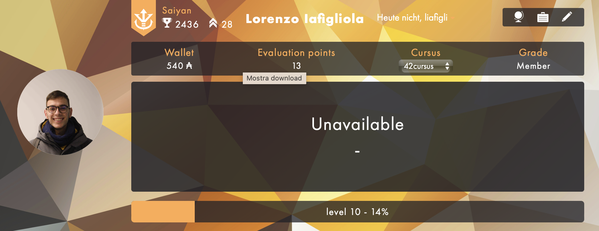

<h3 align="center">IAFI 👋 </h3>
<h4  align="center"><a href="https://github.com/iafi01/42corso">42 Cursus Projects</a></h4>
  <a href="https://github.com/iafi01/42corso">
  <a href="https://github.com/iafi01/42corso">
  42 Cursus Projects</a>

<!--
**iafi01/iafi01** is a ✨ _special_ ✨ repository because its `README.md` (this file) appears on your GitHub profile.

Here are some ideas to get you started:

- 🔭 I’m currently working on ...
- 🌱 I’m currently learning ...
- 👯 I’m looking to collaborate on ...
- 🤔 I’m looking for help with ...
- 💬 Ask me about ...
- 📫 How to reach me: ...
- 😄 Pronouns: ...
- ⚡ Fun fact: ...
-->

